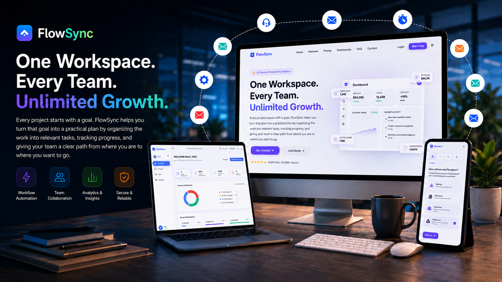
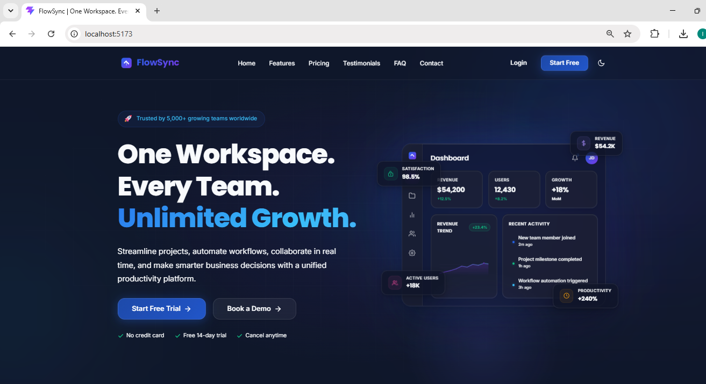
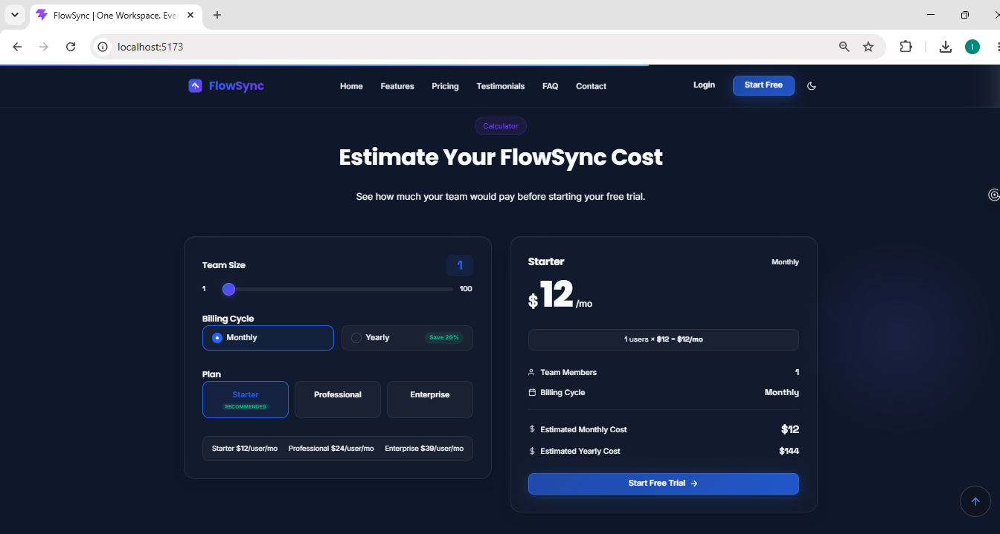
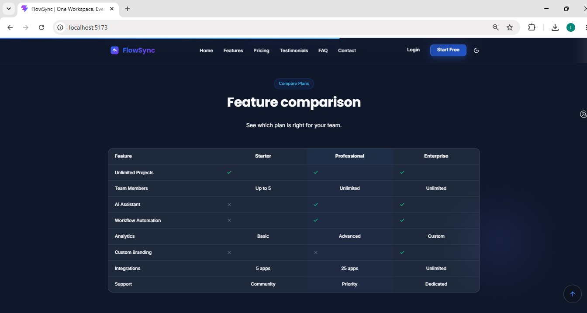
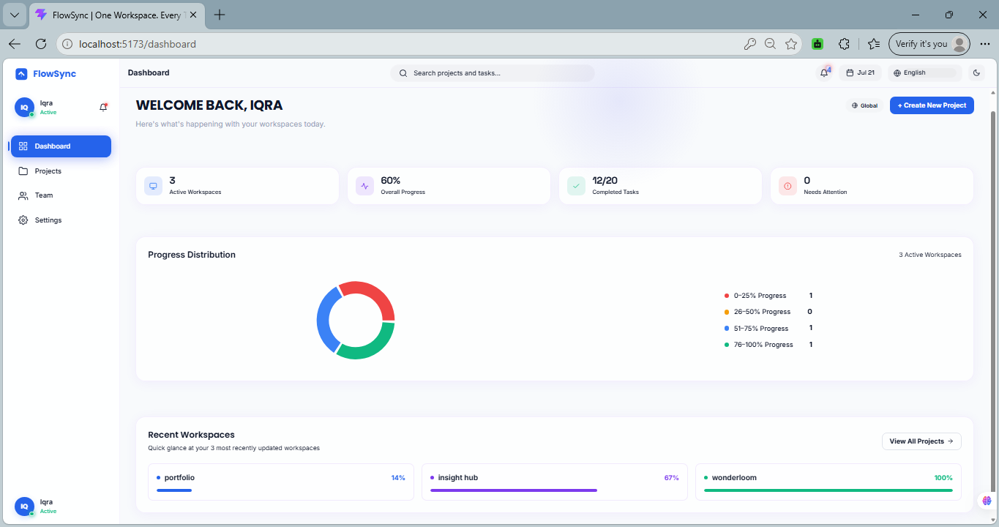
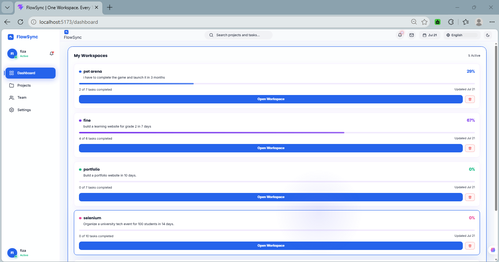
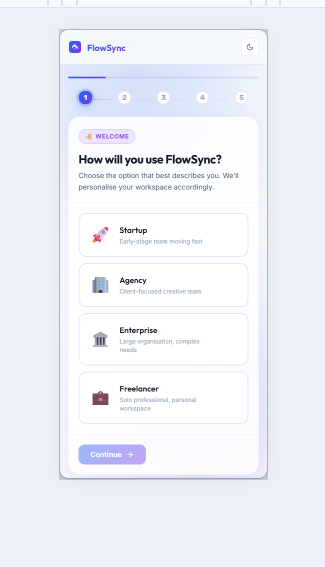

# 🚀 FlowSync — Turn Project Goals Into Structured Progress

<div align="center">



### Turn project goals into structured workflows, actionable tasks, and measurable progress.

<br>


</div>

---

## ✦ About FlowSync

FlowSync is a productivity workspace built around a simple idea:

> **A project goal should not remain an unstructured idea.**

Users create a project, describe what they want to accomplish in natural language, and FlowSync transforms that goal into a structured workflow that can be managed and tracked.

### The core product loop

**Create a Project → Describe the Goal → Generate a Workflow → Manage Tasks → Track Progress**

---

## 🎬 Product Demo

<!-- Add the final product GIF here -->

<p align="center">
  
</p>

---

## ✨ Key Features

### 🧭 Workspace Onboarding

Users can create a personalized workspace by providing:

* Personal information
* Company details
* Industry
* Team size
* Workspace type
* Team members and roles
* Theme preference
* Language preference

After onboarding, users enter their workspace and can begin creating projects.

---

### 📁 Goal-Based Project Workflows

Users can create multiple projects and describe their desired outcome in natural language.

FlowSync is designed to generate workflows that reflect the user's actual project goal instead of applying the same generic task list to every project.

For example:

> **Goal:** Launch a website for a small business in 30 days.

A relevant workflow may include:

* Define project requirements
* Plan the website structure
* Design the interface
* Build the website
* Add and review content
* Test the project
* Launch the website

The core concept is:

**Project Context + User Goal → Relevant Workflow**

---

### ✅ Interactive Task Management

Generated workflow tasks can be managed through a simple progress system:

**Todo → In Progress → Completed**

Users can:

* Update task statuses
* Track completed tasks
* View project progress
* Continue working on existing projects

Progress is calculated from actual task data rather than hardcoded values.

---

### 📊 Workspace Dashboard

The dashboard provides an overview of the user's workspace, including:

* Total projects
* Total tasks
* Completed tasks
* Overall progress
* Project activity
* Individual project progress

The dashboard provides a high-level overview, while each project has its own workspace for detailed task management.

---

### 🎨 Personalization

FlowSync supports:

* Dark mode
* Light mode
* Language preferences
* Persistent workspace preferences
* Responsive layouts for desktop, tablet, and mobile

---

## 🧩 Product Experience

FlowSync also includes a complete SaaS-style product experience with:

* Product-focused landing page
* Interactive product showcase
* Pricing calculator
* Monthly/yearly billing toggle
* Feature comparison table
* Testimonials carousel
* FAQ accordion
* Contact form validation
* Blog content with API integration
* Loading, error, and success states
* Smooth UI animations
* Responsive layouts

---

## 🛠 Tech Stack

| Technology            | Purpose                                |
| --------------------- | -------------------------------------- |
| **React**             | Component-based user interface         |
| **Vite**              | Fast development and build tooling     |
| **JavaScript (ES6+)** | Application logic                      |
| **Redux Toolkit**     | Global application and workspace state |
| **React Router**      | Page and route navigation              |
| **Recharts**          | Data visualization                     |
| **Framer Motion**     | UI animations and transitions          |
| **CSS3**              | Responsive visual system               |
| **LocalStorage API**  | Persistent frontend data               |

---

## 📸 Screenshots

### 🏠 Landing Page



---

### 💰 Pricing Experience



---

### 📊 Feature Comparison

<div align="center">



</div>

---

### 📊 Workspace Dashboard



---

### 📁 Project Workspace



---

### 📱 Responsive Mobile Experience

<div align="center">



</div>

---

## 📁 Project Structure

```text
FlowSync/
├── public/
├── src/
│   ├── assets/
│   ├── components/
│   ├── data/
│   ├── hooks/
│   ├── pages/
│   ├── redux/
│   ├── services/
    ├── styles/
│   ├── utils/
│   ├── App.jsx
│   ├── main.jsx
│   └── index.css
├── package.json
├── vite.config.js
└── README.md
```
---

## 🚀 Getting Started

### 1. Clone the repository

```bash
git clone https://github.com/iqraamin054-code/FlowSync-React.git
```

### 2. Navigate to the project

```bash
cd FlowSync-React
```

### 3. Install dependencies

```bash
npm install
```

### 4. Start the development server

```bash
npm run dev
```

### 5. Build for production

```bash
npm run build
```

### 6. Preview the production build

```bash
npm run preview
```

---

## 🎯 Project Focus

FlowSync was built to explore how a modern SaaS productivity product can combine:

* Product-oriented interface design
* React component architecture
* Global state management
* Persistent workspace data
* Structured project workflows
* Task progress tracking
* Responsive design
* Theme personalization
* Interactive product experiences

The project focuses on turning a simple concept into a complete product experience:

> **From an idea → to a project → to a workflow → to measurable progress.**

---

🧠 Development with Codex & GPT-5.6

During the hackathon submission period, Codex and GPT-5.6 were used as AI-assisted development tools to support implementation, debugging, workflow logic refinement, UI iteration, and development acceleration.

The product direction, feature priorities, design decisions, testing, and final integration were guided throughout the development process.

---

## 👩‍💻 Author

<div align="center">

### Iqra Amin

**Software Engineering Student | Frontend Developer**

Building practical software projects while exploring modern web development and product design.

[GitHub](https://github.com/iqraamin054-code) • [LinkedIn](https://www.linkedin.com/in/iqraamin-dev)

</div>

---

## 📄 License

This project was created for educational, portfolio, and demonstration purposes.

All product names and branding are fictional and created solely for demonstration.
