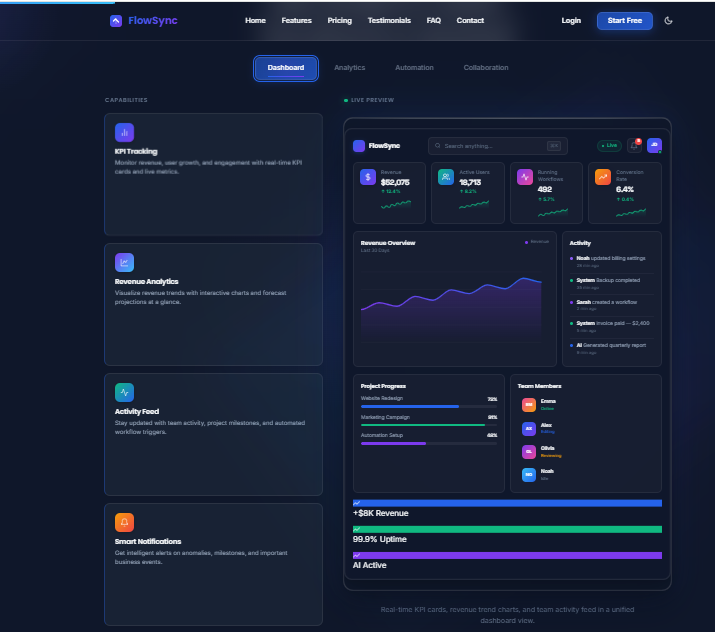
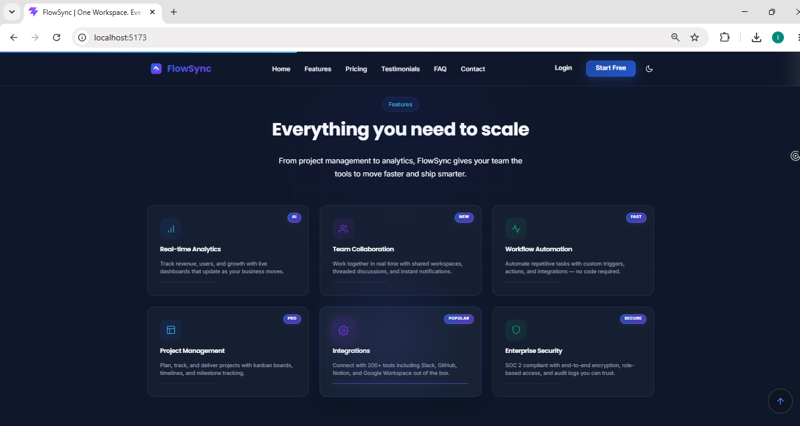
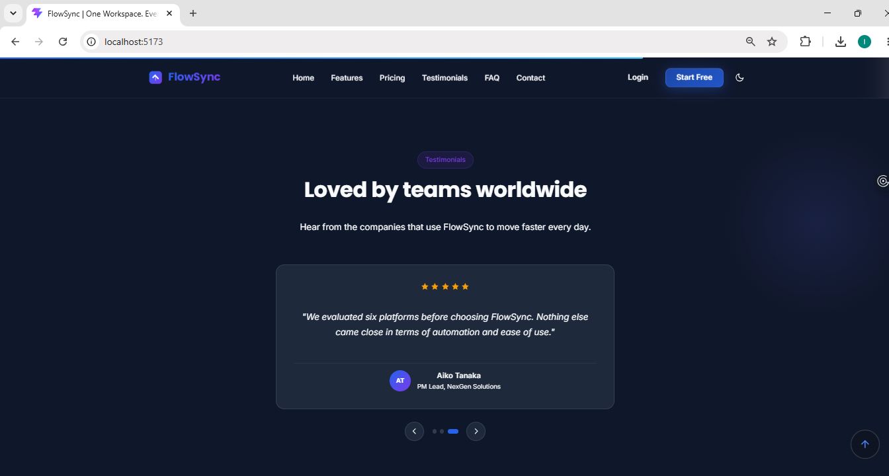
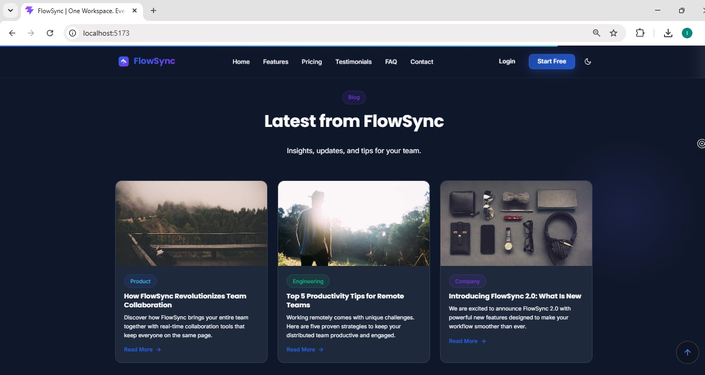
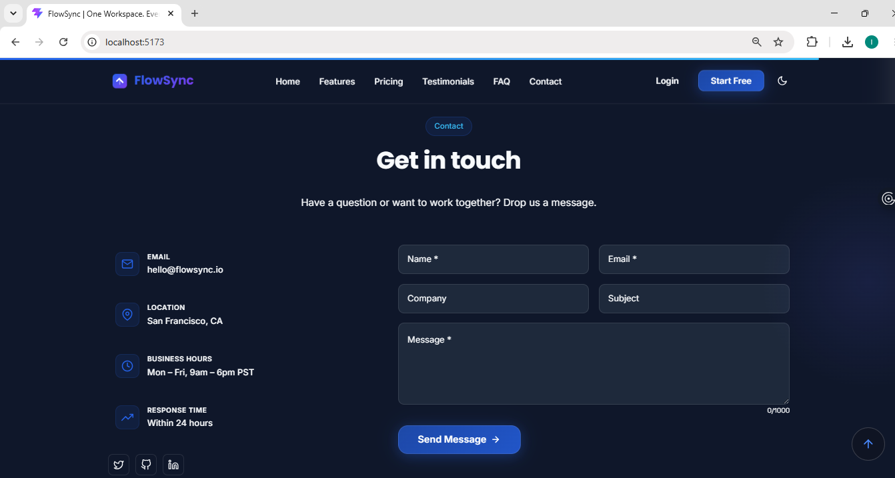

# 🚀 FlowSync — Interactive SaaS Landing Page & Product Experience Platform

<div align="center">


</div>

---

<p align="center">

</p>

---

# 📖 Overview

**FlowSync** is a modern SaaS-inspired Product Experience Platform built using **React** and **Vite**.

The project recreates the experience of a professional software company's marketing website through interactive dashboards, engaging animations, dynamic pricing, API-driven content, reusable React components, and responsive layouts.

It focuses on delivering a premium frontend experience while following modern React development practices, accessibility guidelines, and clean component architecture.

---

# ✨ Features

## 🏠 Landing Page

- Modern Hero Section
- Sticky Navigation
- Smooth Scroll Navigation
- Interactive Product Showcase
- Animated Statistics
- Feature Highlights
- Responsive Layout
- Dark & Light Theme

---

## 🚀 Product Experience

- Interactive Dashboard Preview
- Dashboard / Analytics / Automation / Collaboration Tabs
- Live KPI Cards
- Animated Charts
- Activity Feed
- Floating Widgets
- Framer Motion Animations

---

## 💰 Pricing

- Monthly / Yearly Toggle
- Dynamic Pricing Calculator
- Feature Comparison Table
- Popular Plan Highlight
- Responsive Pricing Cards

---

## ⭐ Customer Experience

- Testimonials Carousel
- FAQ Accordion
- Contact Form
- Form Validation
- Success & Error States

---

## 📰 Blog Preview

- API Integration (DummyJSON)
- Loading State
- Error Handling
- Blog Cards
- Read More Modal

---

## 🎨 User Experience

- Premium Glassmorphism Design
- Blue & Purple Gradient Theme
- Responsive Design
- Smooth Animations
- Modern Typography
- Reusable Components
- Interactive Hover Effects

---

# ♿ Accessibility

- Semantic HTML
- Keyboard Navigation
- ARIA Labels
- Visible Focus Indicators
- Accessible Forms
- Reduced Motion Support

---

# ⚡ Performance

- Component-Based Architecture
- Lazy Loading
- Optimized Assets
- Responsive Images
- Reusable Components
- Clean Folder Structure

---

# 🛠 Tech Stack

- React.js
- Vite
- JavaScript (ES6+)
- React Router
- Framer Motion
- CSS3
- Local Storage API
- DummyJSON API
- CSS Grid
- Flexbox

---

# 📁 Project Structure

```text
FlowSync/
│
├── public/
│
├── src/
│   ├── assets/
│   ├── components/
│   ├── context/
│   ├── data/
│   ├── hooks/
│   ├── pages/
│   ├── utils/
│   ├── App.jsx
│   ├── main.jsx
│   └── index.css
│
├── package.json
├── vite.config.js
└── README.md
```

---

# 📸 Screenshots

## 🏠 Hero Section


---

## 🚀 Product Experience



---

## ⭐ Features



---

## 💰 Pricing Calculator


---

## 📊 Feature Comparison


---

## 💬 Testimonials



---

## 📰 Blog Preview



---

## 📞 Contact Section



---

<div align="center">

## 📱 Mobile View


</div>

---

# 🚀 Getting Started

Clone the repository

```bash
git clone https://github.com/iqraamin054-code/FlowSync-React.git
```

Navigate into the project

```bash
cd FlowSync-React
```

Install dependencies

```bash
npm install
```

Run the development server

```bash
npm run dev
```

Build the project

```bash
npm run build
```

Preview the production build

```bash
npm run preview
```

---

# 🎯 Learning Outcomes

This project helped strengthen practical experience in:

- React Component Architecture
- React Router
- API Integration
- Framer Motion Animations
- Responsive Design
- Modern SaaS UI Design
- Component Reusability
- Frontend Performance Optimization
- Accessibility Best Practices
- Professional Project Organization

---

# 🔮 Future Enhancements

- Backend Authentication
- User Dashboard
- Real-Time Notifications
- Payment Integration
- User Profiles
- Team Collaboration
- Calendar Integration
- Task Management
- Admin Dashboard

---

# 👩‍💻 Author

**Iqra Amin**

Software Engineering Student  
Frontend Developer

🔗 **GitHub**  
https://github.com/iqraamin054-code

🔗 **LinkedIn**  
https://www.linkedin.com/in/iqraamin-dev

---

# 📄 License

This project was developed for educational purposes and internship evaluation.

All product names, branding, and content are fictional and created solely for demonstration purposes.
